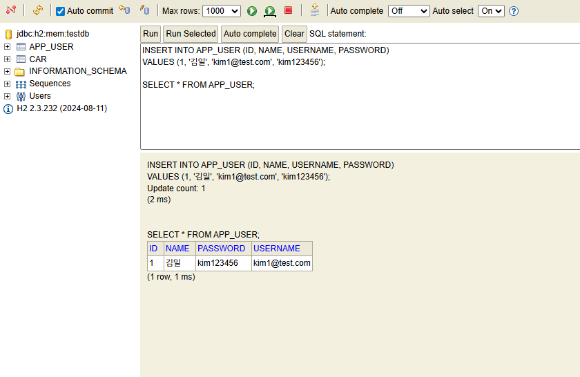
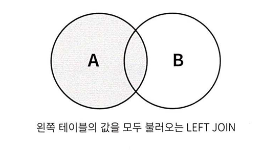
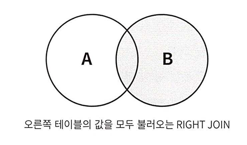
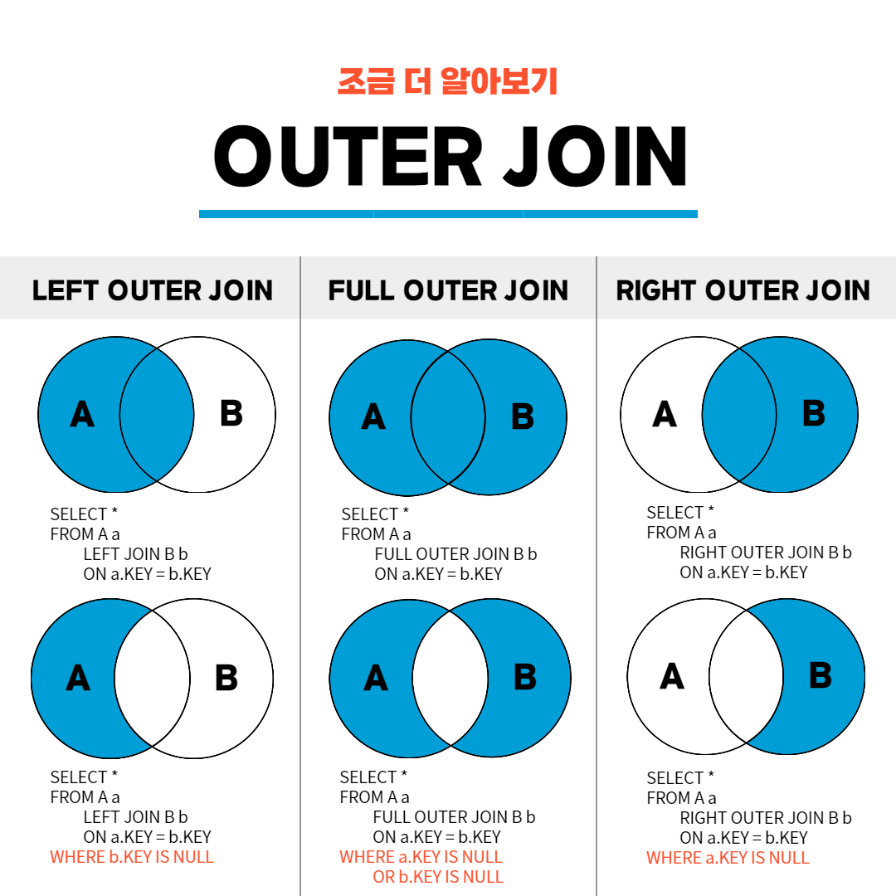

# 입실 체크 해주세요 !! 🎈
# HediSQL도 켜두세요

# 추후 시험 계획
1. SQL 시험(2 개 과목) : 2월 19일
2. Back-Front 구현 시험(5 개 과목) : 3월 25일(SpringBoot + React)
3. 배포 관련 시험(2 개 과목) : 3월 30일
4. 이후 팀 프로젝트 예정(이지만 3월 30일 이전에 미리 팀 빌딩 하고 작업을 할 수 있도록 할 예정입니다).

# 자리 배치 계획
1. 2월 20일 SpringBoot 프로젝트 생성 후 자리 이동.
2. 일정이 정해지지 않았지만 React 프로젝트 생성 후 자리 이동(optional)
3. 팀 프로젝트 위해서 팀 빌딩 후에 자리 배치(마지막까지 고정)

# SQL 수업
## GROUP BY
- 어떤 기준으로 묶어서 _계산_ 할 것인가 ?
예를 들어
```sql
SELECT * FROM users GROUP BY country;
```
을 호출했을 경우

라고 나옵니다.
원래 `SELECT * FROM users;`를 호출했을 경우 row 개수가 77 개 였는데 지금 보면 18 개로 줄어있죠. 여기서의 의미는 country의 row 값들 중 중복은 전부 안나오고 가장 위에 있는 row 하나만 나오기 때문에 저희 데이터 기준 null 포함 18 개 국가 종류, null 제외 17 개만 나옵니다. COUNT(country)를 한 결과와 같습니다(이전 수업 확인).

- 집계 함수를 활용하여 특정 컬럼의 row 값들을 계산해봤습니다. 함수로 평균을 계산하거나 전체 합을 구해봤습니다.
- 하지만 집계 함수만으로는 원하는 결과를 얻을 수 없을 때가 있습니다. 예를 들어 전체 회원 수가 아니라 국가별 회원수를 구하거나, 월별 회원수를 구할 때 등이겠죠.

- 문제 예시 : users에서 국가별 회원 수를 추출하기
```sql
SELECT country, COUNT(DISTINCT id) AS 국가별사용자수
  FROM users
  GROUP BY country
  ;
```
- GROUP BY를 이용하여 국가별 회원 수를 추출했습니다. GROUP BY는 **집계 함수와 함께 사용**되며 GROUP BY 기준 컬럼은 SELECT에서 집계 함수를 사용할 때 묶어서 계산을 수행하는 기준이 됩니다. 
- GROUP BY를 이용할 경우 데이터를 분류하고 계산하면서 데이터의 특성을 더 잘 파악할 수 있습니다.

- 응용 문제 : users에서 거주 국가가 Korea인 회원 중 마케팅 수신에 동의한 회원 수를 구하시오. 컬럼명 '한국동의자수'

```sql
SELECT COUNT(DISTINCT id) AS 한국동의자수
  FROM users WHERE country = 'Korea' AND is_marketing_agree = 1
  ;
```


이상의 경우 결국 한국의 마케팅 수신 동의자 수만 출력할 수 있습니다. 예를 들어 USA를 추가하고 싶다고 가정해보겠습니다.
**안되는 예시**
```sql
SELECT country, COUNT(DISTINCT id) AS 한국동의자수
  FROM users WHERE country IN ('Korea', 'USA') AND is_marketing_agree = 1
  ;
```
그래서 이상과 같이 작성했을 때,

와 같이 한국 및 미국의 전체 마케팅 동의한 애들만 튀어나온다는 단점이 있습니다. 총합만 구할 수 있다는 의미가 되겠네요.

결국 WHERE절만 가지고는 국가별로 마케팅 수신 동의 여부를 쿼리문 하나씩 써가지고 직접 엑셀로 입력하고 거기서 합 함수를 다시 써야할지도 모르겠습니다.

- 하지만 GROUP BY를 사용하게 되면 '국가별 회원수' 및 '동의자수'의 교집합을 충족하는 쿼리를 작성할 수 있습니다.

- users에서 거주 국가 별로 마케팅 수신 동의한 회원 및 동의하지 회원 수를 구할겁니다.

```sql
SELECT country, is_marketing_agree AS 마케팅수신동의, COUNT(DISTINCT id) AS 회원수 
  FROM users
  GROUP BY country, is_marketing_agree
  ORDER BY country, 회원수 DESC
  ;
```

```sql
SELECT country AS 국가, is_marketing_agree AS 마케팅수신동의, COUNT(DISTINCT id) AS 회원수 
  FROM users
  GROUP BY 국가, 마케팅수신동의
  ORDER BY country, 회원수 DESC
  ;
```
그리고 이상과 같이 작성했을 때도 SQL문이 이상없이 실행되는 것을 확인해봤을 때 GROUP BY와 SELECT 중에서 SELECT가 먼저 실행되는 것을 알 수 있습니다(ORDER BY도 SELECT보다 늦게 실행됐습니다).

- ORDER BY는 맨마지막입니다. 그래서 지금 추론할 수 있는 것은
  1. FROM - 테이블 선택해야 하니까
  2. SELECT - 테이블 내에서 컬럼 선택해야하니까(컬럼명 편집 가능)
  3. GROUP BY - 편집된 컬럼명으로 분류가 가능하다는 점에서 _추론 가능_
  4. ORDER BY - 최종 결과를 기준으로 오름/내림 차순을 적용하기 때문에.

- 그런데 의문을 제기한다면 그 이유가 시험에서 어떻게 나왔느냐입니다.그러면 시험 기준으로 하시면 됩니다.
- DBMS마다 편집된 컬럼을 허용하지 않는 경우가 있기 때문입니다.

- 마찬가지로 ORDER BY처럼 GROUP BY도 작성된 순서를 기준으로 합니다. 즉 이상의 쿼리문에서는 country를 기준으로 먼저 그룹화를 하고, 그 다음 is_marketing_agree를 기준으로 그룹화하게 됩니다.

- 응용 문제 : users에서 국가 내 도시 별 회원수를 추출하시오(국가명은 알파벳순으로 정렬하고, 국가 내에서는 회원 수 기준 내림차순 정렬하시오, 컬럼명 한국어로 다 바꾸시오).


```sql
SELECT country AS 국가, city AS 도시, COUNT(DISTINCT id) AS 회원수
  FROM users
  GROUP BY country, city
  ORDER BY 국가, 회원수 DESC, city
  ;
```
분석 시에 지표를 그룹으로 묶는 기준을 차원(dimesion)이라고 하고, 각 차원에 대해 계산을 수행할 때 적용하는 계산식을 메트릭(metric)이라고 합니다.


이상의 이미지에서 국가 / 도시는 차원이고, 회원수는 메트릭입니다.

- 응용 문제 : users에서 월별(2013-01) 가입 회원 수를 출력하시오(created_at 컬럼을 활용하고, 최신 순으로 정렬합니다. 컬럼명 한국어)


```sql
SELECT SUBSTR(created_at, 1, 7) AS 월별, COUNT(DISTINCT id) AS 회원수
  FROM users
  GROUP BY SUBSTR(created_at, 1, 7)
  ORDER BY 월별 DESC
  ;
```
이상에서 중요한 것은 SUBSTR() 함수가 컬럼에 적용되는 집계 함수가 아니라 row에 적용되는 일반함수라는 점입니다. 그러니까 GROUP BY에서 created_at을 잘라낸 애를 기준으로 그룹화하는 것이 가능하다는 점이 포인트입니다.

## GROUP BY 전체 정리
- 그룹별로 수치를 계산할 때 사용.
- 콤마를 기준으로 두 개 이상 지정 가능, 이 때 명시된 컬럼 순서에 따라 그룹의 층위가 결정되므로 순서를 명확하게 설계할 필요가 있음.
1.
```
GROUP BY col1, col2, ... 두 개 이상의 기준 지정
```
  - GROUP BY 지정시에는 적은 컬럼을 SELECT문에도 동일한 순서로 작성하여 계산된 수치의 기준을 알려주면 좋습니다. 예를 들어 이상에서처럼 국가 내 도시별 회원 수를 구했는데 회원수 컬럼만 출력한다면 어느 국가, 어느 도시의 회원 수인지 알 수 없으므로,
```sql
SELECT col1, col2, ...
  ...
  GROUP BY col1, col2
```
  2. GROUP BY에 작성한 기준 컬ㄹ럼은 DISTINCT를 사용한 것처럼 **중복 없이** 표시됩니다. 컬럼 값이 동일한 데이터는 같은 그룹으로 묶여 중복 제거가 일어납니다. 또한 GROUP BY에 작성한 기준 컬럼 외에는 중복 제거된 row들만 남게 되므로 추가적인 부분은 집계함수를 사용하여 그룹 별 연산을 따로 수행해줘야 합니다.
```sql
SELECT col1, col2, count(*), sum(col3)...
  ...
  GROUP BY col1, col2
```

## 연습 문제
1. 주문 상세 정보 테이블에서 주문 아이디 별 주문 수량의 총합을 출력하시오.(주문 수량의 총합이 내림 차순일 것 - 컬럼명 통제 안하겠습니다 적당히 한국어로 쓸 것, 시험과 관련 있도록 작성할 것)


2. 주문 정보 테이블에서 직원 아이디 별, 회원 아이디별로 주문 건수를 출력하시오(단 직원 아이디 기준 오름 차순으로 먼저 정렬한 뒤에 주문 건수 기준 내림 차순 정렬할 것.)


3. 주문 정보 테이블에서 _월별_ 로 주문한 회원 수를 출력하시오(최신 순 정렬)

```sql
SELECT order_id, SUM(quantity) AS 주문합계 
  FROM orderdetails 
  GROUP BY order_id 
  ORDER BY 주문합계 DESC;  

SELECT staff_id, user_id, COUNT(*) AS 주문건수 
  FROM orders GROUP BY staff_id, user_id 
  ORDER BY staff_id, 주문건수 DESC;

SELECT staff_id, user_id, COUNT(DISTINCT id) AS 주문건수 
  FROM orders 
  GROUP BY staff_id, user_id 
  ORDER BY staff_id, 주문건수 DESC;

SELECT SUBSTR(order_date, 1, 7) AS 월별
  , COUNT(DISTINCT user_id) AS 월별주문회원수 
  FROM orders GROUP BY SUBSTR(order_date, 1, 7) 
  ORDER BY 월별 DESC;
```

## HAVING
- 집계 값은 어떻게 필터링하는가 ?
  - 예를 들어 회원 수가 n 명 이상인 국가의 회원 수만 보고 싶다면 어떻게 해야하는가? 와 같은 질문에 답변할 수 있습니다.
  - 현재 상황에서 WHERE은 SELECT 이전에 실행되기 때문에 집계함수가 적용 전이라서 COUNT() 함수의 적용 후 결과값을 WHERE절에 반영할 수 없다는 문제점이 있겠네요.
  - GROUP BY로 그룹화하고 집계한 데이터를 필터링 할 때 WHERE을 쓰기 어려운 이유를 알아보고, HAVING 로직을 학습하겠습니다.

- 예시 문제 : users에서 country가 한국, 미국, 프랑스인 회원 수를 국가별로 계산하는 쿼리문을 작성하시오.

```sql
SELECT country, COUNT(DISTINCT id) AS 국가별회원수
  FROM users
  WHERE country IN ('Korea', 'France', 'USA')
  GROUP BY country
  ;
```
그래서 특정 국가의 회원수는 WHERE 통해 추출이 가능합니다. 얘는 집계함수의 결과값이 아니라 국가별 필터링이 먼저 적용됐기 때문입니다. 하지만 3 개 국의 회원수 말고 전체 국가를 기준으로 8 명 이상인 국가의 회원 수만 추출하기 위해서는 집계함수의 실행이 선행되어야 할 겁니다.
```sql
WHERE COUNT(DISTINCT id) > 7
```
와 같이 작성하려고 하면 결과적으로 집계함수를 SELECT 절이 아닌 다른 부분에 작성했기 때문에 오류가 발생할겁니다.

-> 그래서 HAVING 씁니다.
```sql
SELECT country, COUNT(DISTINCT id) AS 국가별회원수
  FROM users
  GROUP BY country
  HAVING COUNT(DISTINCT id) > 7
  ORDER BY 국가별회원수 DESC
  ;
```

- 문제 : orders에서 담당 직원별 주문 건수와 주문 회원 수를 계산하고, 주문 건수가 10 건 이상이면서 주문 회원 수가 40 명 이하인 데이터만 출력하시오(단, 주문 건수 기준으로 내림 차순 정렬할 것. staff_id, user_id, id 컬럼을 활용하고 전체 컬럼을 적절한 한국어로 바꾸시오).


```sql
SELECT staff_id AS 직원아이디
  , COUNT(DISTINCT id) AS 주문건수
  , COUNT(DISTINCT user_id) AS 주문회원수
  FROM orders
  GROUP BY 직원아이디
  HAVING 주문건수 > 9 AND 주문회원수 < 41
  ORDER BY 주문건수 DESC;
```

- 연습 문제
  1. orders 테이블에서 회원별 주문건수를 추출하시오(주문건수가 7건 이상인 회원의 정보만 추출하고, 주문 건수 기준으로 내림 차순 정렬할 것. user_id / id 컬럼 활용하시오.)


  2. users에서 국가별 도시 수와와 국가별 회원 수를 추출하시오(단, 도시 수가 5 개 이상이고 회원 수가 3 명 이상인 정보만 추출하고, 도시수, 회원수 기준으로 모두 내림차순 정렬할 것)

  

  3. users에서 미국, 브라질, 한국, 아르헨티나, 멕시코에 거주중인 회원 수를 국가별로 추출하시오(단 회원 수가 5 명 이상인 국가만 추출하고 회원 수 기준 내림 차순 정렬하시오.)

  

```sql
SELECT user_id AS 사용자아이디, COUNT(DISTINCT id) AS 주문건수 
	FROM orders 
	GROUP BY user_id 
	HAVING 주문건수 >= 7 
	ORDER BY 주문건수 DESC;

SELECT country AS 국가, COUNT(DISTINCT city) AS 도시, COUNT(DISTINCT id) AS 회원수 
	FROM users 
	GROUP BY country 
	HAVING 도시 >= 5 AND 회원수 >= 3 
	ORDER BY 도시 DESC, 회원수 DESC;
	
SELECT country AS 국가, COUNT(DISTINCT Id) AS 회원수 
	FROM users 
	WHERE country IN ("USA", "Brazil", "Korea", "Argentina", "Mexico") 
	GROUP BY country 
	HAVING 회원수 >= 5 
	ORDER BY 회원수 DESC;
```

## SQL 실무에서의 사례 - GROUP BY / HAVING
1. 배달서비스 앱에서 : 2023-08에 음식 분류별(한식, 중식, 분식, ...) 주문 건수 _집계_
```sql
SELECT 음식분류, COUNT(DISTINCT id) AS 주문건수
  FROM 주문정보
  WHERE 주문시간(월) = '2023-08'    # WHERE은 중복제거가 아니니까요.
  GROUP BY 음식분류
  ORDER BY 주문건수 DESC;
```
2. 차량대여서비스 에서 : 주행거리가 3000km 이상인 회원 수를 차량 종류별로 추출
```sql
SELECT 차량종류, COUNT(DISTINCT 회원아이디) AS 회원수
  FROM 차량운행정보
  GROUP BY 차량종류
  HAVING SUM(주행거리) >= 3000
  ORDER BY 회원수 DESC;
```

3. SNS에서 : 팔로워가 2000 명 이상인 회원수를 국가별로 추출
```sql
SELECT 국가명, COUNT(DISTINCT 회원아이디) AS 회원수
  FROM 팔로워정보
  GROUP BY 국가명
  HAVING COUNT(DISTINCT 팔로워아이디) >= 2000
  ORDER BY 회원수 DESC;
```
# 여러 가지 데이터를 원하는대로 합치기
## 학습 목표
  - 여러 테이블에 분산된 데이터(정규화된)를 하나로 모아서 다루는 법을 익힐 수 있다.
    - SQL에서 `JOIN`은 여러 테이블에서 데이터를 가져와 결합하는 기능을 하는데, 엑셀에서는 VLOOKUP함수와 유사한 기능입니다. 엑셀에서는 여러 개의 시트를 하나로 합쳐서 표현해야 할 때가 있는데, SQL에서 동일하게 다수의 테이블에 흩어져 있는 데이터들을 모아서 하나의 테이블로 구성하는 키워드입니다.
    - 저희 수업 기준으로는 특정 주문을 담당한 직원의 이름을 확인하고 싶다면, 주문 아이디는 orders 테이블에 존재하고, 직원 이름은 staff 테이블에 존재하기 때문에 별개의 테이블에서 데이터를 추출한 다음, RDBMS에 맡게 row를 구성해야 합니다.

    - 학습 범위
      1. 테이블을 좌우로 결합하는 `JOIN`
      2. 테이블을 상하로 결합하는 `UNION`
      3. 임시로 테이블을 구성해놓고 걔를 기준으로 SELECT문을 실행시키는 서브 쿼리(SUB QUERY)
### 학습 범위 추가 설명
  1. 테이블을 좌우로 결합하는 JOIN
    - orders에서 직원 정보 테이블인 staff를 합친다고 가정했을 때, 두 테이블을 합칠 때의 '기준'이 필요합니다. 공통되는 부분이 있어야 3번 아이디 주문을 한 사용자와 직원이 있을거고, 그 담당 직원을 뽑아낼 수 있을테니까요. `JOIN`은 두 테이블의 컬럼 구성이 **달라도 결합이 가능**하며, 같은 테이블을 결합하더라도 선택하는 JOIN 유형에 따라서 다른 결과가 나옵니다. 테이블을 결합하는 기준이자 공통분모에 해당하는 key에 대한 학습 및 JOIN 연산에 대해 수업할 예정.
  2. 테이블을 상하로 연결하는 UNION
    - JOIN은 테이블을 좌우로 결합하여 데이터의 컬럼 수가 늘어나는 반면에 UNION은 **컬럼 구성이 같은 두 쿼리 결과 집합을 상하로 결합**합니다. 따라서 UNION으로 데이터를 결합한 결과는 결합 전의 컬럼 구성과 동일합니다. 그렇다면 도출되는 제약 조건은 결합 대상인 두 쿼리의 결과 집합은 컬럼 개수와 같아야만 한다는 점입니다.
  3. 눈속임 테이블을 임시로 만드는 서브 쿼리
    - 데이터가 저장된 상태 그대로 쿼리를 수행하기도 하지만 **쿼리를 수행한 결과를 값이나 조건으로 하여** 쿼리를 수행하기도 합니다. 즉, 쿼리 속의 쿼리를 이용하기도 하는데, 필요한 값이나 테이블이 없으면 임시로 만드는 서브 쿼리의 개념이 존재합니다. 

## JOIN
- 예제 데이터를 기준으로 했을 때, 국가별로 주문 건수를 확인하고 싶다면 어떡해야할지를 고민하겠습니다. 국가는 users 테이블에 있었고, 주문 건수는 orders 테이블에 있었습니다. 그 다음에 국가별로 GROUP BY를 써야 할 것 같고, SELECT에 COUNT() 집계 함수도 써야 할 것 같네요. 여기서 도출되는 결론은 일단 users, orders 테이블을 합쳐야 한다는 점입니다.

복수의 테이블을 하나로 연결할 때는 여러 조건을 적용할 수 있는데, 특히 공통 부분인 키를 활용하여 JOIN에서 제공하는 기능을 학습하겠습니다.

- 기본적으로는 _좌우로 합친다_ . 는 점입니다. 

- 예제 문제 : users와 orders를 하나로 결합하여 추출해봅시다(_단 주문 정보가 있는 회원의 정보만 출력하시오_)

```sql
SELECT *
  FROM users u INNER JOIN orders o ON u.id = o.user_id;
```
- JOIN 테이블1 약칭1, 테이블2 약칭2 ON 약칭1.pk = 약칭2.fk;

- 여러 테이블을 하나의 FROM에서 다룰 때에는 약칭을 설정하는 것이 가능합니다. 다만 컬럼명을 직접적으로 수정하는 것이 아니기 때문에 AS가 붙지 않습니다. 그리고 이렇게 설정한 약칭은 각 테이블의 개별 컬럼에 접근할 때 사용합니다. 예를 들어 users에는 있지만 orders에는 없는 is_auth라는 컬럼을 이용할 때에는 u.is_auth와 같은 식으로 쓰이겠네요.

- key의 개념 : 두 개의 테이블에서 공통된 부분을 RDB에서 key라고 하는데, 관계형 데이터베이스에서 키 값은 테이블에 반드시 1 개 이상 존재하도록 설계되어있고, 테이블에서 개별 행을 유일하게 구분 짓습니다. 따라서 키 값은 컬럼 내에서 중복되지 않으며 개별 행을 구분해야 하므로 null값을 가질 수 없습니다.

- 이상의 개념에서 알 수 있는것처럼 유일하게 식별하는 고유값이기 때문에 이 값을 중복없이 카운트하면 정확히 계산할 수 있습니다. 그래서 내테이블.id = 남테이블.kf명; 이 default JOIN 연산이라고 할 수 있습니다.

* 참조 사항 : 키 값은 테이블 내에서 고유한 값을 가지므로 한 테이블에서 개수를 계산할 때 중복되지 않아야 하는데, 여러 테이블을 조인할 경우 키 값도 중복될 수 있습니다. 예를 들어 회원 아이디가 7인 사람이 3 번 주문했다면, users 테이블 내에서는 7이 한 번 나왔겠지만 orders테이블에서는 고유값이 아니기 때문에 7이 복수로 나올 수 있습니다. 그렇기 때문에 이상의 쿼리문을 작성한 결과값에서 id 7인 row가 세 번 나왔다고 할 수 있습니다.
- 그러면 users에서의 고유값이 중복되었으니까 JOIN 연산 결과에서 중복이 안되는 값은 o.id가 될겁니다. 고민해보시기 바랍니다.

- PK(Primary Key) vs. FK(Foreign Key)
  - 키 값은 기본 키와 외래 키로 나눌 수 있습니다. PK는 각 테이블이 자체적으로 가지고 있는 고유한 키 값에 해당하고, FK는 다른 테이블이 가지고 있는 PK를 참조한 키 값에 해당합니다. 그렇기 때문에 PK와 같은 자료형을 가집니다. 또한 그 값도 다른 테이블의 PK와 동일합니다. 예를 들어, PK의 값이 A, B, C만 존재한다면 FK 역시 A, B, C만 존재해야 합니다.
  - 하지만 차이점으로 중복되지 않는다는 특징을 가진 PK값과는 달리 참조하고 있는 관계에 따라 FK에서는 중복이 일어날 수 있습니다. users 테이블의 고유값인 id가 주문을 3 번 수행했다면 orders테이블의 user_id는 세 번 중복으로 나타날 수 있습니다(이 관계를 1:N 관계 / 일대다 관계라고 말합니다. N:M도 있을 수 있음).

### INNER JOIN
  - 두 테이블의 키 값이 일치하는 row의 정보만 가지고 옴. 수학에서의 집합을 예로 든다면 교집합에 해당함.
  

- 문제 : users 테이블의 id(컬럼명 유저아이디), username, created_at, phone, marketing_agree, country, city와 orders 테이블의 id(컬럼명 주문아이디), staff_id, order_date를 INNER JOIN하여 출력하시오(FROM 다음에 SELECT를 호출하기 때문에 약칭을 쓸 수 있음). 
```sql
SELECT 
  u.id AS 유저아이디
  , u.username
  , u.created_at
  , u.is_marketing_agree
  , u.country, u.city
  , o.id AS 주문아이디
  , o.staff_id
  , o.order_date 
  FROM users u INNER JOIN orders o 
    ON u.id = o.user_id;
```
- 예시 문제 : users에서 orders 테이블을 하나로 결합하여 출력하시오(_단, 주문 정보가 없는 회원의 정보도 모두 출력하시오_)
```
SELECT *
  FROM users u LEFT JOIN orders o
  ON u.id = o.user_id;
```
### LEFT JOIN
- 교집합 뿐만 아니라 JOIN 명령문의 왼쪽에 위치한 테이블의 모든 결과값을 추출합니다. 예시에서는 users 테이블이 왼쪽에 위치하므로 users 테이블의 모든 결과값을 가지고 오는데, 만약에 주문 정보가 없다면 u.id = 1에서 확인할 수 있듯이 orders 테이블 부분의 컬럼들에 null값으로 가지고 오게 됩니다.
- 왼쪽 테이블의 차집합 + 왼/오 테이블의 교집합


`LEFT JOIN`이라고 하기도 하고 `LEFT OUTER JOIN`

- LEFT / INNER JOIN은 실무에서 둘 다 자주 쓰입니다. 데이터를 결합하는 경우 대부분 한쪽 테이블의 값을 보전해야할 때가 많은데, 이번의 LEFT JOIN에서도 그렇습니다.

- 그리고 INNER JOIN과 달리, 주문 정보가 없는 애들만 추출하는 것이 가능합니다.

- 문제 : users와 orders를 하나로 결합하여 출력하시오(단, 주문 정보가 없는 회원의 정보만 추출하시오).
```sql
SELECT *
  FROM users u LEFT JOIN orders o ON u.id = o.user_id
  WHERE o.id IS null;
```
그렇다면 이상의 코드의 경우의 영역은, users 테이블 에서 users테이블과 orders테이블의 교집합을 뺀 차집합 부분이라는 사실을 알 수 있습니다.
- 그리고 이 영역이 차집합이라는 점에서 INNER JOIN으로는 구현이 어렵다는 것도 알 수 있겠습니다.

- 문제 : users 테이블과 orders 테이블을 하나로 합친 다음에 걔를 기준을로 orderdetails 테이블도 합치세요(단, 주문 정보가 없는 회원의 주문 정보도 전부 출력하고, orderdetails는 INNER JOIN하시오. 회원아이디, 이메일, 연락처, 주문아이디, 제품아이디 컬럼을 출력하시오).

먼저 LEFT JOIN을 실행하시면 걔를 기준으로 새로운 테이블이 생성된다고 보시면 됩니다. 그럼 새로 생성된 u+o 테이블을 기준으로 또 INNER JOIN하면 되죠(전부 FROM절에 속해있습니다).

```sql
SELECT u.id, u.username, u.phone, o.id, od.product_id
	FROM users u LEFT JOIN orders o ON u.id = o.user_id 
	INNER JOIN orderdetails od ON o.id = od.order_id;
```
- FROM 절 내에서 JOIN은 중첩해서 사용이 가능. 필요한 정보가 셋 이상의 테이블에 나뉘어 있어도, key를 기반으로 연결할 수만 있다면 한 번에 조회가 가능합니다.

- 일단 기본적으로 테이블 하나 만들 때마다 PK가 존재할거고, 그 테이블 컨셉에 맞는 정보들이 있을겁니다. 근데 다른 테이블과의 연결성 때문에 FK를 또 붙이게 될겁니다. 그래서 특정 user가 어떤 제품을 샀는지 확인하기 위해서는 users + orders + orderdetails를 결합해야 하는데 어느 구역으로 가면 PK, FK들이 덕지덕지 붙어있는 상황이 옵니다. 힘들게 JOIN해서 얻을 수 있는 정보는 product_id 밖에 없는 상황이 되겠네요.
혹은 특정 유저가 자기 주문을 담당한 staff의 이름을 알고 싶다면, users + orders + staff가 되어야 합니다.

- 예제 문제 users와 orders를 결합하여 출력하시오(_단, 회원 정보가 없는 주문 정보도 출력하시오._)
```sql
SELECT *
  FROM users u RIGHT JOIN orders o
  ON u.id = o.user_id;
```

이상의 경우에 결과를 확인해보시면 INNER JOIN의 수행결과와 동일하다고 나오는데, 예시로 사용한 테이블 간의 포함관계 때문입니다. 예를 들어 가상의 웹 사이트에서 users테이블에 id가 없는 회원의 정보는 orders 테이블에 존재할 수가 없기 때문에 회원 정보가 없는 주문 정보는 존재할 수 없습니다. 그 결과 INNER JOIN과 동일한 결과로 보입니다.
- 많은 실무시에 RIGHT JOIN 대신에 LEFT JOIN을 사용할 것을 권장합니다.



* EMP / DEP_NO / DEP_NAME / EMP_NAME


## 시험용 SELECT문 실행 순서
1. FROM(JOIN 포함) : 대상 테이블을 참조하고 JOIN 적용으로 합쳐진 데이터셋(테이블)을 구성.
2. WHERE : 행 단위를 필터링(집계함수사용불가)
3. GROUP BY : 데이터를 특정 컬럼 기준으로 그룹화
4. HAVING : 그룹화된 데이터에 조건을 걸어서 필터링
5. SELECT : 출력할 컬럼 선택하고 Alias 부여(컬럼명 편집 시점)
6. DISTINCT : 중복된 행을 제거
7. ORDER BY : 데이터를 정렬
8. LIMIT / TOP / OFFSET : 최종 결과 중 출력할 개수 제한
### 이상의 순서에서의 중요한 점
1. 별칭(Alias)의 제약 : `SELECT`의 단계가 `WHERE`, `GROUP BY`보다 늦게 실행되기 때문에 WHERE절에서는 SELECT에서 정의한 별칭을 사용할 수 없는 반면에 `ORDER BY`는 별칭 사용이 가능합니다.
2. 성능 최적화 : 실행 순서를 기반으로 했을 때 쿼리 최적화를 쉽게 할 수 있습니다. 예를 들어 WHERE 절에서 데이터 개수를 줄여놓게 되면 이후 GROUP BY나 ORDER BY시에 부하가 줄어들 수 있겠네요.
3. 표준에서의 예외 : 요새 DBMS는 사용자 편의를 위해 GROUP BY에서 SELECT를 허용하기는 하지만(그래서 실무에서는 쓰지만), 이론적으로는 SQL에서 WHERE/GROUP BY에서 별칭 사용이 불가능합니다.
  - 안되는 대표적인 SQL server : Oracle / SQL server(MSSQL)